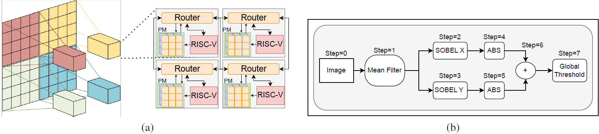
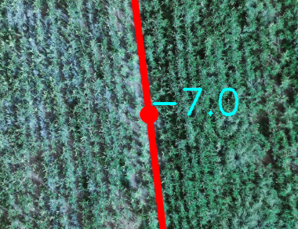
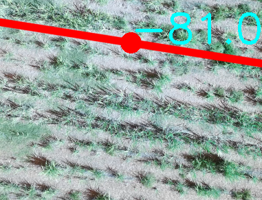
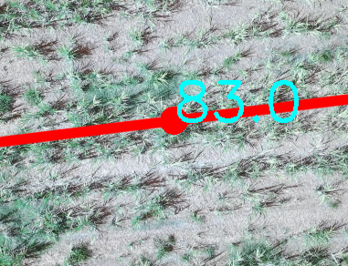

# Our heterogeneous multicore for image processing

Dedicated to make public our IP/CV processor, RISC-V based MPSoC *MPRISCV* targeting ZCU104 Zynq development board, this repository ‣ contains the hardware platform configuration design: source-codes in VHDL, tcl scripts, makefiles, C/C++ sources of *tile-code and arm-code* to synthesise, implement the MPRISCV in programmable logic, program the *tiles,* and program the ARM-Host to act as the orchestrator of a heterogeneous multiprocessor dedicated to bring efficiency in IP/CV processing.

Two applications are included as an example: 1. The sobel contour detection using simple IP filters and 2. Angle detection of sugar cane crop which makes use of more elaborate resources based in ARM-Host working with Ubuntu OS.

---

# Overview
<a name="Overview"></a>
Region-based segmentation streamlines parallel IP/CV processing by segmenting filters into *steps* and *frames*. The architecture is built on a 2-D MPSoC-NoC of NxN tiles, each containing a [PicoRV32](https://github.com/YosysHQ/picorv32.git) RISC-V core, a Pixel-Memory, and a Router. Each *tile* has a predetermined setup, programmed by the ARM-host, specifying its network position, image size, and assigned image region.



This is how MPRISCV is set to exploit spatial parallelism in IP/CV toolchains. (a) Region-based scheme for IP/CV applications. (b) Depiction of IP/CV toolchain for Sobel edge contour detection.


This is a *tile* which involves a pixel memory (PM), one PicoRV32 core and a Router

The Pixel-Memory (PM) stores and responds to pixel requests from other tiles, mapping by four-dimensional array  $\text{{Address}}(x, y, s, f)$.

>
$$ \text{{Address}}(x, y, s, f) = (x - x_{\text{{init}}}) \cdot n_\text{{frame}} \cdot n_\text{{step}} + \text{{image height}} \cdot (y - y_{\text{{init}}}) \cdot n_\text{{frame}} \cdot n_\text{{step}} + f \cdot s + f $$
>

Address is referenced by $x,y$, which are the pixel coordinates of a specific *step* from a specific *frame.* Here, $n_{\text{frame}}$ and $n_{\text{step}}$ indicate how many steps and frames are stored in PM, while $x_{\text{init}}$ and $y_{\text{init}}$ are the $x,y$ coordinates of the initial pixel for the respective *tile*.

The Router establish the communication between *tiles* with default message protocol and by XY routing allowing every tile being capable of accessing any other *tile*'s PM without resources from the RISC-V core.

---

## MPRISC-V filters implemented

The main application capable of better exploiting MPRISCV is the sobel edge contour. It requires many *steps* and clear IP/CV algorithms that are mean blurring kernels of 3x3 and 5x5, the $\text{sobel}_x$ and  $\text{sobel}_y$, absolute value (*abs*) and sum of images, and threshold. Behold images processed by the MPRISC-V

<div style="text-align: center;">

<div style="text-align: center;">

<p>


</p>

<p>


</p>

<p>


</p>

<p>


</p>

<p>


</p>

<p>


</p>

<p>


</p>

<p>


</p>

<p>


</p>

</div>


**Sobel contour detection**

All of the filters mentioned earlier compose this application requiring control over execution flow$^1$, thus, it must ensure to follow [flowchart](#Overview).

Here's an HTML snippet to place the nine images you specified into three columns, side by side. Each column will contain three images:
<div style="text-align: center;">


<br>


<br>


</div>


 $^1$ todo this explanation about control the execution synchrony.

## Angle detection of sugar cane crops

This algorithm is designed to help guide harvesters to maintain an appropriate tilt, preventing accidents and encroachment onto the path of other harvesters. The plan is to deploy this on Unmanned Aerial Vehicles (UAVs) flying at low altitudes to control the harvester. The Savitzky-Golay filter and heuristics are used to identify the angle.

In this context, MPRISCV serves as a pre-processor to smooth the image, reducing noise errors. More continuous images are likely to require less time for heuristic processing. The ARM-Host, running the Ubuntu OS, handles the Savitzky-Golay filtering part. We provide several images with the detected slope angle.

<div style="text-align: center;">

<p>


</p>

<p>


</p>

<p>


</p>

<p>


</p>

<p>


</p>

<p>


</p>

<p>


</p>

<p>


</p>

<p>


</p>

<p>




<p>



</p>


---

# Results

The results are obtained from 1. Experiment measurement for time performance obtained in prototype with C/C++ `time.h` library 2. Vivado power estimation 3. Vivado resource utilisation report.

<aside>
📢 **The results made available here, are also in our in the repository ‣ featuring**:

1. The **results (reports)** generated by Vivado synthesis/implementation are available in the <code><a href="https://github.com/arthurmlima/mprvs/tree/main/hw/reports">hw/reports</a></code>


2. **Time performance results** for implemented filters in *tile-code* mean3x3, mean5x5, sobel, abs and general is available <code><a href="https://github.com/arthurmlima/mprvs/tree/main/fw/core/tables">fw/core/tables</a></code>

<aside>
💽 **Vivado projects synthesised and implemented (2023.2)** in case if you want to checkout the Vivado project but it is too painful to follow all the steps 🫢

[https://drive.google.com/file/d/1aLE9S6nBXxAqSJZGOuDyeZZ-dGoKBiNJ/view?usp=drive_web](https://drive.google.com/file/d/1aLE9S6nBXxAqSJZGOuDyeZZ-dGoKBiNJ/view?usp=drive_web)

[https://drive.google.com/file/d/1aIitfj6I7o95J68_00P-kt7Ot6x9LUL4/view?usp=drive_link](https://drive.google.com/file/d/1aIitfj6I7o95J68_00P-kt7Ot6x9LUL4/view?usp=drive_link)

[https://drive.google.com/file/d/1aI5oWEbT89cCrOOELtEj2swJovI_D8Lp/view?usp=drive_link](https://drive.google.com/file/d/1aI5oWEbT89cCrOOELtEj2swJovI_D8Lp/view?usp=drive_link)

[https://drive.google.com/file/d/1a4KiNa6CGiUD2JxMwoYx-KvASIYZSvt6/view?usp=drive_link](https://drive.google.com/file/d/1a4KiNa6CGiUD2JxMwoYx-KvASIYZSvt6/view?usp=drive_link)

[https://drive.google.com/file/d/1_zkEPpsth-ZBMo0K-ktxDnm_A62luuVQ/view?usp=drive_link](https://drive.google.com/file/d/1_zkEPpsth-ZBMo0K-ktxDnm_A62luuVQ/view?usp=drive_link)

[https://drive.google.com/file/d/1_sblyPTjsGQvgiquoHmirWnRvRBoFm-o/view?usp=drive_link](https://drive.google.com/file/d/1_sblyPTjsGQvgiquoHmirWnRvRBoFm-o/view?usp=drive_link)

</aside>

</aside>

*Note: while the repository and the data furnished have different hardware topologies, only 3x3 was prototyped and* MPRISCV *3x3 is the only architecture which results are shown in this document.* *Despite the script* <code><a href="https://github.com/arthurmlima/mprvs/blob/main/hw/build.tcl">hw/build.tcl</a></code> *automatically generating the hardware for any square topology, however* <code><a href="https://github.com/arthurmlima/mprvs/blob/main/fw/mpriscv/firmware.c">fw/mpriscv/firmware.c</a></code> *and*  <code><a href="https://github.com/arthurmlima/mprvs/blob/main/fw/mpriscv/smp.c">fw/mpriscv/smp.c</a></code> *becomes cat’s cradle and correctly mapping every detail to automatic script is a challenge.*


## Time measurement of processing

We make available the data obtained in experiments performed to measure the processing data (tables) efficiency of MPRISCV.

- although not present in this document `t0` and `t5` they are in the repository <code><a href="https://github.com/arthurmlima/mprvs/tree/main/fw/core/tables">fw/core/tables</a></code> but there are not any motive for it apart from my mental issues.

- `t1` is bonded to the 0 as the first pixel of the frame sent to the MPRISCV.
- `t2` is the time in microseconds spent from `t1` to the last pixel of the frame sent to the MPRISCV.
- `t3` is the time in microseconds spent from `t1` to the first pixel received by the MPRISCV.
- `t4` is the time in microseconds spent from `t1` to the last pixel received by the MPRISCV.

Each row is a different image in dataset for this testing.
`t4` is the total time spent using the MPRISCV (communication and image processing);
`t3-t2` This is an estimate of the MPRISCV processing time. The actual processing time is expected to be slightly less than the estimate.
Each of these tables are from code for only the filter in question. Example: <code><a href="https://github.com/arthurmlima/mprvs/blob/main/fw/core/tables/abs.xlsx">fw/core/abs.xlsx</a></code> test results settings had a firmware to perform only the ABS. Except for <code><a href="https://github.com/arthurmlima/mprvs/blob/main/fw/core/tables/geral.xlsx">fw/core/general.xlsx</a></code> that performs all the filters.


### MPRISCV 3x3 sobel contour detection application

For this test of *sobel contour detection* 9 images shown previously was used in our data-set.
<table style="float: left; margin-right: 20px;">
<thead>
<tr>
<th><strong><em>Abs</em></strong></th>
<th><strong>Sobel</strong></th>
</tr>
</thead>
<tbody>
<tr>
<td>
<table>
<thead>
<tr>
<th>t1</th>
<th>t2</th>
<th>t3</th>
<th>t4</th>
</tr>
</thead>
<tbody>
<tr>
<td>1</td>
<td>1022057</td>
<td>1234341</td>
<td>2666821</td>
</tr>
<tr>
<td>1</td>
<td>1021519</td>
<td>1233782</td>
<td>2665795</td>
</tr>
<tr>
<td>1</td>
<td>1021401</td>
<td>1233669</td>
<td>2665850</td>
</tr>
<tr>
<td>1</td>
<td>1021888</td>
<td>1234153</td>
<td>2666338</td>
</tr>
<tr>
<td>1</td>
<td>1021703</td>
<td>1233969</td>
<td>2666197</td>
</tr>
<tr>
<td>1</td>
<td>1021760</td>
<td>1234026</td>
<td>2666265</td>
</tr>
<tr>
<td>1</td>
<td>1021828</td>
<td>1234093</td>
<td>2666119</td>
</tr>
<tr>
<td>1</td>
<td>1021718</td>
<td>1233983</td>
<td>2666422</td>
</tr>
<tr>
<td>1</td>
<td>1021534</td>
<td>1233798</td>
<td>2665926</td>
</tr>
</tbody>
</table>
</td>
<td>
<table>
<thead>
<tr>
<th>t1</th>
<th>t2</th>
<th>t3</th>
<th>t4</th>
</tr>
</thead>
<tbody>
<tr>
<td>1</td>
<td>1022124</td>
<td>2570542</td>
<td>4002817</td>
</tr>
<tr>
<td>1</td>
<td>1021536</td>
<td>2569904</td>
<td>4002189</td>
</tr>
<tr>
<td>0</td>
<td>1021326</td>
<td>2569688</td>
<td>4001923</td>
</tr>
<tr>
<td>1</td>
<td>1021791</td>
<td>2570002</td>
<td>4002338</td>
</tr>
<tr>
<td>1</td>
<td>1021621</td>
<td>2569467</td>
<td>4001574</td>
</tr>
<tr>
<td>1</td>
<td>1022078</td>
<td>2570238</td>
<td>4002975</td>
</tr>
<tr>
<td>1</td>
<td>1021745</td>
<td>2569860</td>
<td>4002037</td>
</tr>
<tr>
<td>1</td>
<td>1022343</td>
<td>2570523</td>
<td>4002762</td>
</tr>
<tr>
<td>1</td>
<td>1021538</td>
<td>2569815</td>
<td>4002184</td>
</tr>
</tbody>
</table>
</td>
</tr>
</tbody>
</table>


<table style="float: left; margin-right: 20px;">
<thead>
<tr>
<th><strong>Mean3x3</strong></th>
<th><strong>Mean5x5</strong></th>
</tr>
</thead>
<tbody>
<tr>
<td>
<table>
<thead>
<tr>
<th>t1</th>
<th>t2</th>
<th>t3</th>
<th>t4</th>
</tr>
</thead>
<tbody>
<tr>
<td>1</td>
<td>1022582</td>
<td>3577600</td>
<td>5012846</td>
</tr>
<tr>
<td>1</td>
<td>1022330</td>
<td>3577310</td>
<td>5012449</td>
</tr>
<tr>
<td>1</td>
<td>1022223</td>
<td>3577185</td>
<td>5012375</td>
</tr>
<tr>
<td>0</td>
<td>1022471</td>
<td>3577435</td>
<td>5012614</td>
</tr>
<tr>
<td>1</td>
<td>1022333</td>
<td>3577297</td>
<td>5012335</td>
</tr>
<tr>
<td>1</td>
<td>1022097</td>
<td>3577062</td>
<td>5012154</td>
</tr>
<tr>
<td>1</td>
<td>1022496</td>
<td>3577462</td>
<td>5012629</td>
</tr>
<tr>
<td>1</td>
<td>1022342</td>
<td>3577308</td>
<td>5012598</td>
</tr>
<tr>
<td>1</td>
<td>1022330</td>
<td>3577295</td>
<td>5012533</td>
</tr>
</tbody>
</table>
</td>
<td>
<table>
<thead>
<tr>
<th>t1</th>
<th>t2</th>
<th>t3</th>
<th>t4</th>
</tr>
</thead>
<tbody>
<tr>
<td>0</td>
<td>1022585</td>
<td>5196090</td>
<td>6628748</td>
</tr>
<tr>
<td>1</td>
<td>1022647</td>
<td>5196061</td>
<td>6629124</td>
</tr>
<tr>
<td>1</td>
<td>1022324</td>
<td>5195648</td>
<td>6628044</td>
</tr>
<tr>
<td>1</td>
<td>1022772</td>
<td>5196101</td>
<td>6628408</td>
</tr>
<tr>
<td>1</td>
<td>1022419</td>
<td>5195748</td>
<td>6628656</td>
</tr>
<tr>
<td>1</td>
<td>1022534</td>
<td>5195865</td>
<td>6628047</td>
</tr>
<tr>
<td>0</td>
<td>1022473</td>
<td>5195804</td>
<td>6628037</td>
</tr>
<tr>
<td>1</td>
<td>1022525</td>
<td>5195857</td>
<td>6628484</td>
</tr>
<tr>
<td>1</td>
<td>1022388</td>
<td>5195721</td>
<td>6628250</td>
</tr>
</tbody>
</table>
</td>
</tr>
</tbody>
</table>


<table style="float: left; margin-right: 20px;">
<thead>
<tr>
<th><strong>General</strong></th>
</tr>
</thead>
<tbody>
<tr>
<td>
<table>
<thead>
          <tr>
            <th>t1</th>
            <th>t2</th>
            <th>t3</th>
            <th>t4</th>
            <th>t1</th>
            <th>t2</th>
            <th>t3</th>
            <th>t4</th>
          </tr>
        </thead>
        <tbody>
          <tr>
            <td>1</td>
            <td>1020676</td>
            <td>6030714</td>
            <td>7465251</td>
            <td>1</td>
            <td>1021116</td>
            <td>6030532</td>
            <td>7464997</td>
          </tr>
          <tr>
            <td>1</td>
            <td>1020904</td>
            <td>6030918</td>
            <td>7465373</td>
            <td>1</td>
            <td>1021454</td>
            <td>6031359</td>
            <td>7466026</td>
          </tr>
          <tr>
            <td>1</td>
            <td>1020834</td>
            <td>6030691</td>
            <td>7465048</td>
            <td>1</td>
            <td>1020966</td>
            <td>6030779</td>
            <td>7465351</td>
          </tr>
          <tr>
            <td>1</td>
            <td>1020858</td>
            <td>6030693</td>
            <td>7465257</td>
            <td>1</td>
            <td>1021153</td>
            <td>6030949</td>
            <td>7465675</td>
          </tr>
          <tr>
            <td>1</td>
            <td>1021040</td>
            <td>6030097</td>
            <td>7464927</td>
            <td>1</td>
            <td>1021076</td>
            <td>6031013</td>
            <td>7465620</td>
          </tr>
          <tr>
            <td>2</td>
            <td>1021028</td>
            <td>6030855</td>
            <td>7465505</td>
            <td>1</td>
            <td>1021276</td>
            <td>6031232</td>
            <td>7465771</td>
          </tr>
          <tr>
            <td>1</td>
            <td>1021084</td>
            <td>6030816</td>
            <td>7465547</td>
            <td>1</td>
            <td>1021314</td>
            <td>6031257</td>
            <td>7465780</td>
          </tr>
          <tr>
            <td>1</td>
            <td>1021062</td>
            <td>6030774</td>
            <td>7465328</td>
            <td>1</td>
            <td>1021376</td>
            <td>6031335</td>
            <td>7466004</td>
          </tr>
          <tr>
            <td>1</td>
            <td>1021103</td>
            <td>6031033</td>
            <td>7465816</td>
            <td>1</td>
            <td>1021194</td>
            <td>6031108</td>
            <td>7465589</td>
          </tr>
          <tr>
            <td>1</td>
            <td>1021243</td>
            <td>6030812</td>
            <td>7465490</td>
            <td>1</td>
            <td>1021492</td>
            <td>6031349</td>
            <td>7465889</td>
          </tr>
          <tr>
            <td>0</td>
            <td>1021272</td>
            <td>6031047</td>
            <td>7465639</td>
            <td>1</td>
            <td>1021070</td>
            <td>6030916</td>
            <td>7465560</td>
          </tr>
          <tr>
            <td>1</td>
            <td>1021157</td>
            <td>6030670</td>
            <td>7465228</td>
            <td>1</td>
            <td>1021405</td>
            <td>6031280</td>
            <td>7466077</td>
          </tr>
          <tr>
            <td>1</td>
            <td>1021540</td>
            <td>6031451</td>
            <td>7466090</td>
            <td>1</td>
            <td>1021179</td>
            <td>6031150</td>
            <td>7465691</td>
          </tr>
          <tr>
            <td>1</td>
            <td>1021258</td>
            <td>6030782</td>
            <td>7465513</td>
            <td>1</td>
            <td>1021461</td>
            <td>6031038</td>
            <td>7465632</td>
          </tr>
          <tr>
            <td>2</td>
            <td>1021364</td>
            <td>6031257</td>
            <td>7465881</td>
            <td>1</td>
            <td>1021225</td>
            <td>6030841</td>
            <td>7465384</td>
          </tr>
          <tr>
            <td>1</td>
            <td>1021004</td>
            <td>6030834</td>
            <td>7465510</td>
            <td>0</td>
            <td>1020785</td>
            <td>6029964</td>
            <td>7464439</td>
          </tr>
          <tr>
            <td>1</td>
            <td>1021223</td>
            <td>6029651</td>
            <td>7464796</td>
            <td>1</td>
            <td>1020624</td>
            <td>6030867</td>
            <td>7465326</td>
          </tr>
          <tr>
            <td>1</td>
            <td>1021189</td>
            <td>6030984</td>
            <td>7465618</td>
            <td>1</td>
            <td>1020762</td>
            <td>6030591</td>
            <td>7465120</td>
          </tr>
          <tr>
            <td>1</td>
            <td>1021415</td>
            <td>6031305</td>
            <td>7465806</td>
            <td>1</td>
            <td>1020798</td>
            <td>6030436</td>
            <td>7464933</td>
          </tr>
          <tr>
            <td>1</td>
            <td>1021274</td>
            <td>6030911</td>
            <td>7465394</td>
            <td>1</td>
            <td>1020783</td>
            <td>6030336</td>
            <td>7464783</td>
          </tr>
          <tr>
            <td>1</td>
            <td>1021179</td>
            <td>6030745</td>
            <td>7465374</td>
            <td>1</td>
            <td>1020714</td>
            <td>6029673</td>
            <td>7464156</td>
          </tr>
        </tbody>
      </table>
    </td>
  </tr>
</table>

### MPRISCV 3x3 sugar cane angle detection

The sugar cane application used the MPRISCV 3x3 for executing a prefilter *Mean3x3* prior to use processing the angle detection of sugar cane lines.

<div style="overflow-x: auto;">
<table>
  <tr>
    <td>
      <table>
        <thead>
          <tr>
            <th>Image Name</th>
            <th>Time app (s)</th>
            <th>Image Name</th>
            <th>Time app (s)</th>
            <th>Image Name</th>
            <th>Time app (s)</th>
          </tr>
        </thead>
        <tbody>
          <tr>
            <td>conf_068</td>
            <td>5.339175</td>
            <td>conf_017</td>
            <td>5.251249</td>
            <td>conf_067</td>
            <td>5.239322</td>
          </tr>
          <tr>
            <td>conf_032</td>
            <td>5.254128</td>
            <td>conf_082</td>
            <td>5.255721</td>
            <td>conf_009</td>
            <td>5.242947</td>
          </tr>
          <tr>
            <td>conf_073</td>
            <td>5.250967</td>
            <td>conf_054</td>
            <td>5.338553</td>
            <td>conf_060</td>
            <td>5.239856</td>
          </tr>
          <tr>
            <td>conf_053</td>
            <td>5.253683</td>
            <td>conf_030</td>
            <td>5.338773</td>
            <td>conf_071</td>
            <td>5.242561</td>
          </tr>
          <tr>
            <td>conf_066</td>
            <td>5.268437</td>
            <td>conf_065</td>
            <td>5.337452</td>
            <td>conf_008</td>
            <td>5.241775</td>
          </tr>
          <tr>
            <td>conf_062</td>
            <td>5.247549</td>
            <td>conf_084</td>
            <td>5.338035</td>
            <td>conf_063</td>
            <td>5.242816</td>
          </tr>
          <tr>
            <td>conf_010</td>
            <td>5.254804</td>
            <td>conf_083</td>
            <td>5.335859</td>
            <td>conf_069</td>
            <td>5.236675</td>
          </tr>
          <tr>
            <td>conf_012</td>
            <td>5.332918</td>
            <td>conf_002</td>
            <td>5.335906</td>
            <td>conf_041</td>
            <td>5.24129</td>
          </tr>
          <tr>
            <td>conf_038</td>
            <td>5.337572</td>
            <td>conf_075</td>
            <td>5.335104</td>
            <td>conf_029</td>
            <td>5.238409</td>
          </tr>
          <tr>
            <td>conf_037</td>
            <td>5.33381</td>
            <td>conf_074</td>
            <td>5.337716</td>
            <td>conf_081</td>
            <td>5.242546</td>
          </tr>
          <tr>
            <td>conf_020</td>
            <td>5.334048</td>
            <td>conf_013</td>
            <td>5.245452</td>
            <td>conf_014</td>
            <td>5.23876</td>
          </tr>
          <tr>
            <td>conf_004</td>
            <td>5.337022</td>
            <td>conf_072</td>
            <td>5.241553</td>
            <td>conf_085</td>
            <td>5.245194</td>
          </tr>
          <tr>
            <td>conf_061</td>
            <td>5.24282</td>
            <td>conf_086</td>
            <td>5.23776</td>
            <td></td>
            <td></td>
          </tr>
        </tbody>
      </table>
    </td>
  </tr>
</table>
</div>


## Power estimation

Regardless of the option for installing in your board. Check out [Getting started](https://www.notion.so/Getting-started-426f838ff0394a55ba38feb84a768372?pvs=21) future section, the repository brings power report `[hw/reports](https://github.com/arthurmlima/mprvs/tree/main/hw/reports)` directory which considers *1x1, 2x2, 3x3, 4x4, 5x5, 6x6* MPRISCV

### MPRISCV 3x3
<div style="overflow-x: auto;">
<table>
  <tr>
    <td>
<div style="overflow-x: auto;">
<table>
<thead>
<tr>
<th>On-Chip</th>
<th>Power (W)</th>
<th>Used</th>
<th>Ava.</th>
<th>Util. (%)</th>
<th>Name</th>
<th>Power (W)</th>
</tr>
</thead>
<tbody>
<tr>
<td>Clocks</td>
<td>0.107</td>
<td>3</td>
<td>---</td>
<td>---</td>
<td>MPRISCV_wrapper</td>
<td>2.864</td>
</tr>
<tr>
<td>CLB Logic</td>
<td>0.021</td>
<td>161720</td>
<td>---</td>
<td>---</td>
<td>MPRISCV_i</td>
<td>2.864</td>
</tr>
<tr>
<td>LUT as Logic</td>
<td>0.016</td>
<td>32451</td>
<td>230400</td>
<td>14.08</td>
<td>tile_0_0</td>
<td>0.023</td>
</tr>
<tr>
<td>CARRY8</td>
<td>0.002</td>
<td>920</td>
<td>28800</td>
<td>3.19</td>
<td>tile_0_1</td>
<td>0.024</td>
</tr>
<tr>
<td>LUT as Distributed RAM</td>
<td>0.002</td>
<td>43560</td>
<td>101760</td>
<td>42.81</td>
<td>tile_0_2</td>
<td>0.023</td>
</tr>
<tr>
<td>LUT as Shift Register</td>
<td>&lt;0.001</td>
<td>70</td>
<td>101760</td>
<td>0.07</td>
<td>tile_1_0</td>
<td>0.023</td>
</tr>
<tr>
<td>Register</td>
<td>&lt;0.001</td>
<td>42369</td>
<td>460800</td>
<td>9.19</td>
<td>tile_1_1</td>
<td>0.027</td>
</tr>
<tr>
<td>Others</td>
<td>0</td>
<td>749</td>
<td>---</td>
<td>---</td>
<td>tile_1_2</td>
<td>0.025</td>
</tr>
<tr>
<td>BUFG</td>
<td>0</td>
<td>10</td>
<td>64</td>
<td>15.63</td>
<td>tile_2_0</td>
<td>0.023</td>
</tr>
<tr>
<td>F7/F8 Muxes</td>
<td>0</td>
<td>34443</td>
<td>230400</td>
<td>14.95</td>
<td>tile_2_1</td>
<td>0.026</td>
</tr>
<tr>
<td>Signals</td>
<td>0.029</td>
<td>83591</td>
<td>---</td>
<td>---</td>
<td>tile_2_2</td>
<td>0.024</td>
</tr>
<tr>
<td>Block RAM</td>
<td>0.057</td>
<td>72</td>
<td>312</td>
<td>23.08</td>
<td>zynq</td>
<td>2.640</td>
</tr>
<tr>
<td>DSPs</td>
<td>0.013</td>
<td>60</td>
<td>1728</td>
<td>3.47</td>
<td>zynq_axi_periph</td>
<td>0.004</td>
</tr>
<tr>
<td>PS8</td>
<td>2.637</td>
<td>1</td>
<td>---</td>
<td>---</td>
<td>s00_couplers</td>
<td>0.002</td>
</tr>
<tr>
<td>Static Power</td>
<td>0.693</td>
<td></td>
<td></td>
<td></td>
<td>xbar</td>
<td>0.002</td>
</tr>
<tr>
<td>PS Static</td>
<td>0.099</td>
<td></td>
<td></td>
<td></td>
<td></td>
<td></td>
</tr>
<tr>
<td>PL Static</td>
<td>0.595</td>
<td></td>
<td></td>
<td></td>
<td></td>
<td></td>
</tr>
<tr>
<td>Total</td>
<td>3.557</td>
<td></td>
<td></td>
<td></td>
<td></td>
</tr>
          </tr>
        </tbody>
      </table>
    </td>
  </tr>
</table>
</div>

<div style="overflow-x: auto;">
<table>
  <tr>
    <td>
<table>
<thead>
<tr>
<th>Name</th>
<th>Power (W)</th>
</tr>
</thead>
<tbody>
<tr>
<td>MPRISCV_wrapper</td>
<td>2.864</td>
</tr>
<tr>
<td>MPRISCV_i</td>
<td>2.864</td>
</tr>
<tr>
<td>tile_0_0</td>
<td>0.023</td>
</tr>
<tr>
<td>tile_0_1</td>
<td>0.024</td>
</tr>
<tr>
<td>tile_0_2</td>
<td>0.023</td>
</tr>
<tr>
<td>tile_1_0</td>
<td>0.023</td>
</tr>
<tr>
<td>tile_1_1</td>
<td>0.027</td>
</tr>
<tr>
<td>tile_1_2</td>
<td>0.025</td>
</tr>
<tr>
<td>tile_2_0</td>
<td>0.023</td>
</tr>
<tr>
<td>tile_2_1</td>
<td>0.026</td>
</tr>
<tr>
<td>tile_2_2</td>
<td>0.024</td>
</tr>
<tr>
<td>zynq</td>
<td>2.640</td>
</tr>
<tr>
<td>zynq_axi_periph</td>
<td>0.004</td>
</tr>
<tr>
<td>s00_couplers</td>
<td>0.002</td>
</tr>
<tr>
<td>xbar</td>
<td>0.002</td>
</tr>
        </tbody>
      </table>
    </td>
  </tr>
</table>
</div>

## Utilisation

The same directory <code><a href="https://github.com/arthurmlima/mprvs/tree/main/hw/reports">hw/reports</a></code> mentioned previously [Power estimation](https://www.notion.so/Power-estimation-14ecbbe901624ea98976eb25d4fa36e7?pvs=21)  has the report for programmable logic resource consumption considering MPRISCV for *1x1, 2x2, 3x3, 4x4, 5x5, 6x6*

### MPRISCV 3x3

<p><strong>CLB Logic</strong></p>
<div style="overflow-x: auto;">
<table>
  <tr>
    <td>
<table>
        <tr>
            <th>Site Type</th>
            <th>Used</th>
            <th>Fixed</th>
            <th>Prohibited</th>
            <th>Available</th>
            <th>Util%</th>
        </tr>
    <tbody>
        <tr>
            <td>CLB LUTs</td>
            <td>76081</td>
            <td>0</td>
            <td>0</td>
            <td>230400</td>
            <td>33.02</td>
        </tr>
        <tr>
            <td>LUT as Logic</td>
            <td>32451</td>
            <td>0</td>
            <td>0</td>
            <td>230400</td>
            <td>14.08</td>
        </tr>
        <tr>
            <td>LUT as Memory</td>
            <td>43630</td>
            <td>0</td>
            <td>0</td>
            <td>101760</td>
            <td>42.88</td>
        </tr>
        <tr>
            <td>LUT as Distributed RAM</td>
            <td>43560</td>
            <td>0</td>
            <td></td>
            <td></td>
            <td></td>
        </tr>
        <tr>
            <td>LUT as Shift Register</td>
            <td>70</td>
            <td>0</td>
            <td></td>
            <td></td>
            <td></td>
        </tr>
        <tr>
            <td>CLB Registers</td>
            <td>42369</td>
            <td>0</td>
            <td>0</td>
            <td>460800</td>
            <td>9.19</td>
        </tr>
        <tr>
            <td>Register as Flip Flop</td>
            <td>42369</td>
            <td>0</td>
            <td>0</td>
            <td>460800</td>
            <td>9.19</td>
        </tr>
        <tr>
            <td>Register as Latch</td>
            <td>0</td>
            <td>0</td>
            <td>0</td>
            <td>460800</td>
            <td>0.00</td>
        </tr>
        <tr>
            <td>CARRY8</td>
            <td>920</td>
            <td>0</td>
            <td>0</td>
            <td>28800</td>
            <td>3.19</td>
        </tr>
        <tr>
            <td>F7 Muxes</td>
            <td>23067</td>
            <td>0</td>
            <td>0</td>
            <td>115200</td>
            <td>20.02</td>
        </tr>
        <tr>
            <td>F8 Muxes</td>
            <td>11376</td>
            <td>0</td>
            <td>0</td>
            <td>57600</td>
            <td>19.75</td>
        </tr>
        <tr>
            <td>F9 Muxes</td>
            <td>0</td>
            <td>0</td>
            <td>0</td>
            <td>28800</td>
            <td>0.00</td>
        </tr>
        </tbody>
      </table>
    </td>
  </tr>
</table>
</div>


<p><strong>CLB Logic Distribution</strong></p>
<p><strong>CLB Logic</strong></p>
<div style="overflow-x: auto;">
<table>
  <tr>
    <td>
    <table>
            <tr>
                <th>Site Type</th>
                <th>Used</th>
                <th>Fixed</th>
                <th>Prohibited</th>
                <th>Available</th>
                <th>Util%</th>
            </tr>
        <tbody>
            <tr>
                <td>CLB</td>
                <td>13411</td>
                <td>0</td>
                <td>0</td>
                <td>28800</td>
                <td>46.57</td>
            </tr>
            <tr>
                <td>CLBL</td>
                <td>5912</td>
                <td>0</td>
                <td></td>
                <td></td>
                <td></td>
            </tr>
            <tr>
                <td>CLBM</td>
                <td>7499</td>
                <td>0</td>
                <td></td>
                <td></td>
                <td></td>
            </tr>
            <tr>
                <td>LUT as Logic</td>
                <td>32451</td>
                <td>0</td>
                <td>0</td>
                <td>230400</td>
                <td>14.08</td>
            </tr>
            <tr>
                <td>using O5 output only</td>
                <td>234</td>
                <td></td>
                <td></td>
                <td></td>
                <td></td>
            </tr>
            <tr>
                <td>using O5 output only</td>
                <td>25437</td>
                <td></td>
                <td></td>
                <td></td>
                <td></td>
            </tr>
            <tr>
                <td>using O5 output only</td>
                <td>6780</td>
                <td></td>
                <td></td>
                <td></td>
                <td></td>
            </tr>
            <tr>
                <td>LUT as Memory</td>
                <td>43630</td>
                <td>0</td>
                <td>0</td>
                <td>101760</td>
                <td>42.88</td>
            </tr>
            <tr>
                <td>LUT as Distributed RAM</td>
                <td>43560</td>
                <td>0</td>
                <td></td>
                <td></td>
                <td></td>
            </tr>
            <tr>
                <td>using O5 output only</td>
                <td>0</td>
                <td></td>
                <td></td>
                <td></td>
                <td></td>
            </tr>
            <tr>
                <td>using O5 output only</td>
                <td>43200</td>
                <td></td>
                <td></td>
                <td></td>
                <td></td>
            </tr>
            <tr>
                <td>using O5 output only</td>
                <td>360</td>
                <td></td>
                <td></td>
                <td></td>
                <td></td>
            </tr>
            <tr>
                <td>LUT as Shift Register</td>
                <td>70</td>
                <td>0</td>
                <td></td>
                <td></td>
                <td></td>
            </tr>
            <tr>
                <td>using O5 output only</td>
                <td>0</td>
                <td></td>
                <td></td>
                <td></td>
                <td></td>
            </tr>
            <tr>
                <td>using O5 output only</td>
                <td>62</td>
                <td></td>
                <td></td>
                <td></td>
                <td></td>
            </tr>
            <tr>
                <td>using O5 output only</td>
                <td>8</td>
                <td></td>
                <td></td>
                <td></td>
                <td></td>
            </tr>
            <tr>
                <td>CLB Registers</td>
                <td>42369</td>
                <td>0</td>
                <td>0</td>
                <td>460800</td>
                <td>9.19</td>
            </tr>
            <tr>
                <td>Register driven from within the CLB</td>
                <td>14231</td>
                <td></td>
                <td></td>
                <td></td>
                <td></td>
            </tr>
            <tr>
                <td>Register driven from outside the CLB</td>
                <td>28138</td>
                <td></td>
                <td></td>
                <td></td>
                <td></td>
            </tr>
            <tr>
                <td>LUT in front of the register is unused</td>
                <td>14559</td>
                <td></td>
                <td></td>
                <td></td>
                <td></td>
            </tr>
            <tr>
                <td>LUT in front of the register is used</td>
                <td>13579</td>
                <td></td>
                <td></td>
                <td></td>
                <td></td>
            </tr>
            <tr>
                <td>Unique Control Sets</td>
                <td>2229</td>
                <td></td>
                <td>0</td>
                <td>57600</td>
                <td>3.87</td>
            </tr>
        </tbody>
      </table>
    </td>
  </tr>
</table>
</div>


*Note: Available Control Sets calculated as Slices * 2.*


🔚 This concludes this the results. Remember that this is set for a very specific number of steps, frames, pixel size, router buffers, and many other factors which costs significantly in the overall design. Refer to [**`hw/build.tcl`**](https://github.com/arthurmlima/mprvs/blob/main/hw/build.tcl) for more about parameters default setup.

# Getting started

The starting point I assume you have Ubuntu 22.04.2 OS running in your ZCU104. **These instructions must be executed in Zynq OS.**

Clone repository and go to the main folder

```bash
~$ git clone https://github.com/arthurmlima/mprvs.git ; cd mprvs
```

Next you will be required to load the bitstream to ZCU104. We made available one bitstream that works with the remaining of the repository. There are two choices, if you want to develop firmware with no changes in architecture, you should stick with **Option 1**. If you wish to try larger models with more cores and different amount of *steps* and *frames,* you cannot avoid the **Option 2**.

<div style="margin-left: 20px;">

## Option 1: load the bitstream directly

Load the bitstream of 3x3 MPRISCV directly from this repository. Keep in mind that this bitstream upload will last only until its rebooted, after the reboot, the standard *.bsp* bitstream will be reloaded and the FPGA unconfigured.


```bash
~/mprvs/$ sudo fpgautil -b mpriscv_wrapper.bit #load the bitstream into fpga and is ready to go
```

## Option 2: Synthesize and implement the bitstream from script tcl

Please take a moment to look at the script <code><a href="https://github.com/arthurmlima/mprvs/blob/main/hw/build.tcl">hw/build.tcl</a></code> and set all variables correctly. The script allows integrating an arbitrary amount of RISC-V cores into a square topology. This script also creates different Vivado projects to synth/impl from n1 cores to n2 cores, in which n1 and n2 is arbitrary, only n2<n1 and it must be a square.


```bash
~/reponame/hw$ vivado -source build.tcl # this must be executed within the Vivado Tcl environment. Windows requires manual setup to abilitate it in system environment.
```
</div>

The directory  `reponame/hw/prjs`  will be created and it is where the vivado projects for MPRISC-V will be available by the names of *N_N* where N is the number of cores in a row/column.  For each project completed, the script records the utilization and the power report generated by Vivado.

Obs: <code><a href="https://github.com/arthurmlima/mprvs/blob/main/hw/build.tcl">hw/build.tcl</a></code> was tested for Vivado 2023.2. Please remember that the address mapping and others must be aligned with those associated in the *tile-code*  <code><a href="https://github.com/arthurmlima/mprvs/blob/main/fw/mpriscv/firmware.c">fw/mpriscv/firmware.c</a></code> and *arm-code in* <code><a href="https://github.com/arthurmlima/mprvs/blob/main/fw/mpriscv/smp.c">fw/mpriscv/smp.c</a></code>


Next we need to install the necessary python packages for the sugar cane application.

What this app does under the hood is calling a dynamically linked library compile for C/C++ which access `/dev/mem`. This is relevant because you must run python app routine as *sudo* in order to meet permissions requirements and for some unknown odd reason to me (for me python is more a snake than scripting program language), pip3 packages installed by users are not seen by *sudo*.

I'm quite certain there is some way of adding `$USER` to package lists shell commands, but for now, run in the eval board running Ubuntu *pip3* as *sudo* like:

This command is for deploying the sugar cane application, not necessary for sobel contour detection

It is also interesting to clone this repository in your embedded Ubuntu. You must now compile the firmware code for the RISC-V. Go to <code><a href="https://github.com/arthurmlima/mprvs/tree/main/fw/mpriscv/rv">fw/mpriscv/rv</a></code> and run the make file. Check it out to understand the step by step that is going on, it involves from the compilation to machine code that the ARM Host will write into cores memory, i.e the *tile-code*


The repository organises by branches the application. The [main branch](https://github.com/arthurmlima/mprvs) features the firmware (*tile-code*) for all image filters mentioned. While the [sugar-cane branch](https://github.com/arthurmlima/mprvs/tree/sugar-cane) has only the mean 3x3 for firmware.


Regardless of the application you plan to deploy, the commands are the same. However, from this point forward make sure you are in the correct branch. Doubts should be sufficed by [this](https://www.bing.com/search?q=How+to+use+branches)

```bash
~/mprvs/fw/mpriscv/rv/$ make program
```

This will write an array with the instructions [`fw/mpriscv/program.h`](https://github.com/arthurmlima/mprvs/blob/main/fw/mpriscv/program.h) to program the PicoRV32 cores.

Go to MPRISC-V directory

```bash
~/mprvs/fw/mpriscv/rv/$ cd ..
```

Compile as shared libraries the program in C/C++ which loads the MPRISCV firmware and issues images transactions between the ARM Host and MPRISCV

```bash
~/mprvs/fw/mpriscv/$ gcc -fPIC -shared smp.c -o mpriscv.so
```

Go to [`fw/core`](https://github.com/arthurmlima/mprvs/tree/main/fw/core) folder for running the application python application which wraps a C/C++ function and transmit the image and/or provide another stage inline processing as the *sugar cane* angle detection by S*avitzky-Golay* filter.

```bash
~/mprvs/fw/mpriscv$ cd ../core
```

Run the application as sudo because it involves writing in the `/dev/mem`

```bash
~/mprvs/fw/core/$ sudo python3 main.py # This is for the sugar-cane branch

~/mprvs/fw/core/$ sudo python3 main_general.py # This is for the main branch
```

Checkout in each main python [`core/main.py`](https://github.com/arthurmlima/mprvs/blob/main/fw/core/main_general.py) file which directory is writing the resulted images and tables.

---
